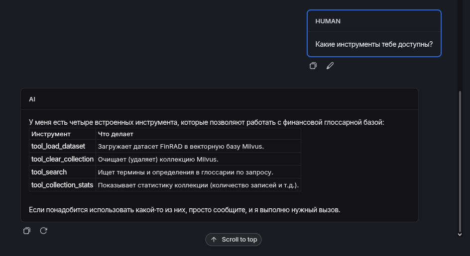
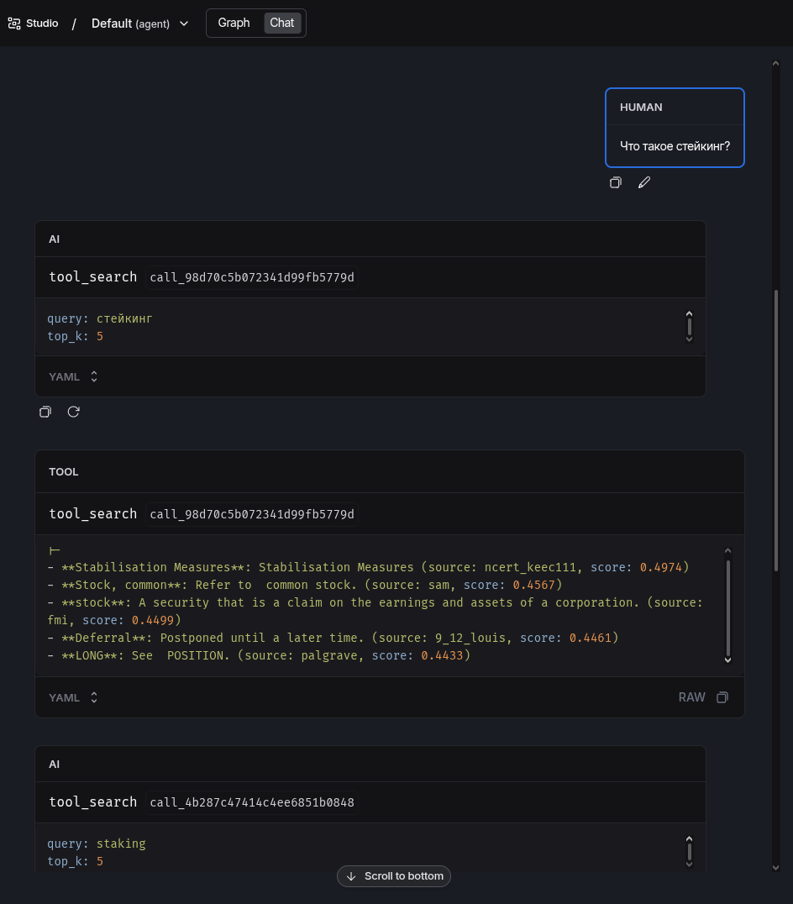
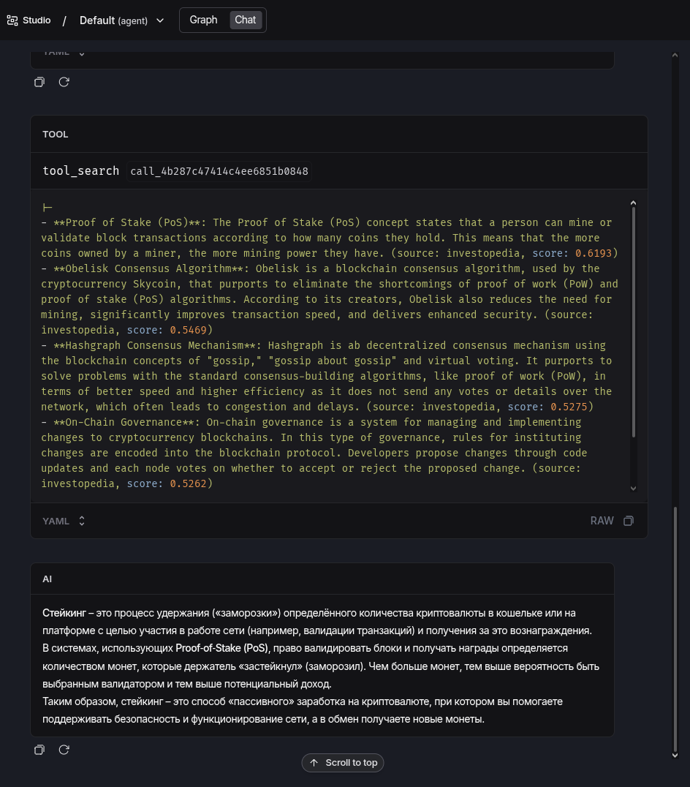
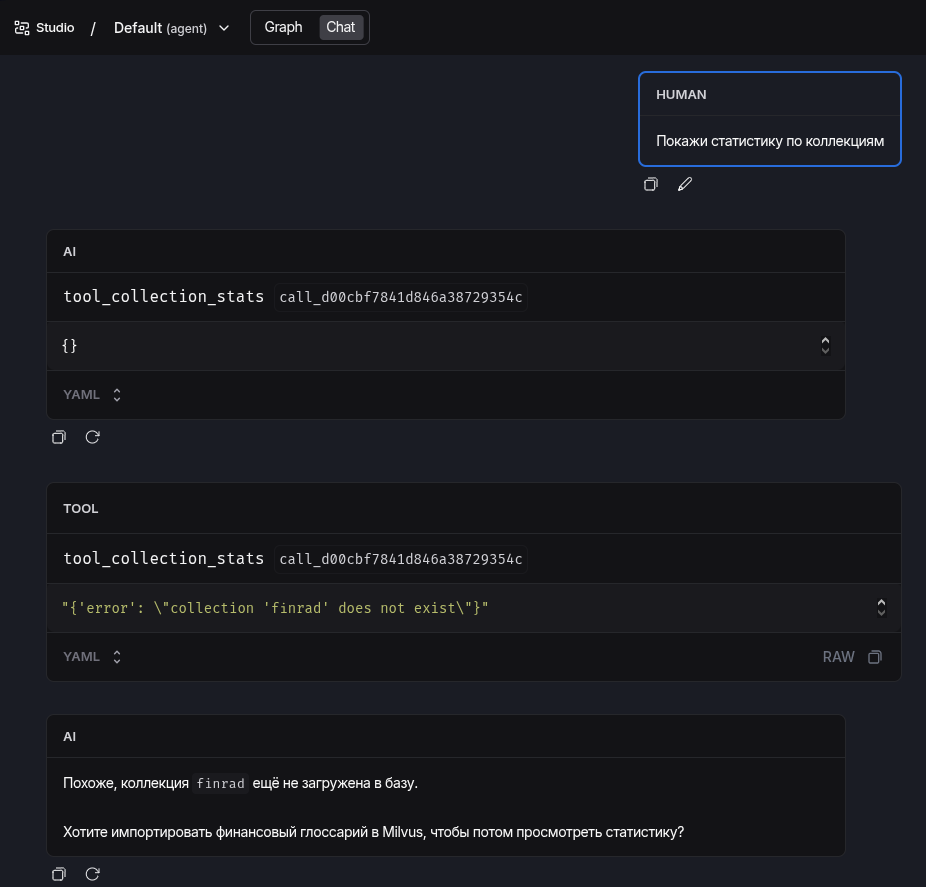

# Agentic Retrieval

ДЗ-1. Chat Agent, у которого есть tool search по векторой БД.

- LLM и embedding model запущены на DGX Spark GB10. Конфигурация SGLang: https://github.com/outlier-xxi/sglang

## Screenshots


Список инструментов




Поиск








## Запуск


```shell

docker compose up -d
uv run langgraph dev
```
